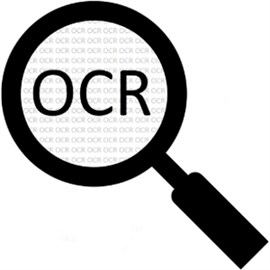

# Health Documents OCR

## Description

End-to-end Optical Character Recognition (OCR) project using multiple networks to detect, transform distorted document images, line level segmentation and character recognition.

## Demo

docker composer

```bash
docker-compose up -d
```

## Development

### Tesseract API

Docker

```bash
cd tesseract-api
docker build -t tesseract-api .
docker run -it --rm -p 5000:5000 tesseract-api
```

## References

[**Tesseract OCR**](https://github.com/tesseract-ocr/tesseract)

[**PyTesseract**](https://github.com/madmaze/pytesseract)
